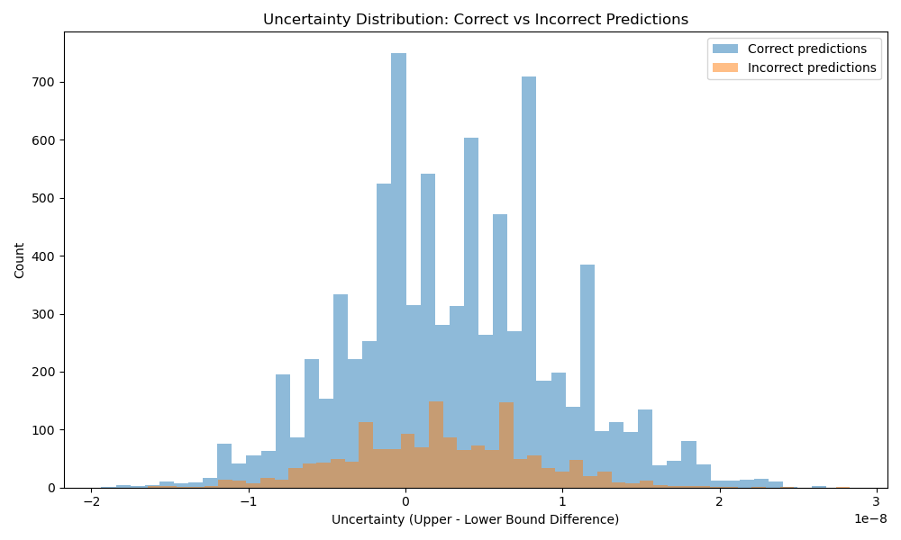
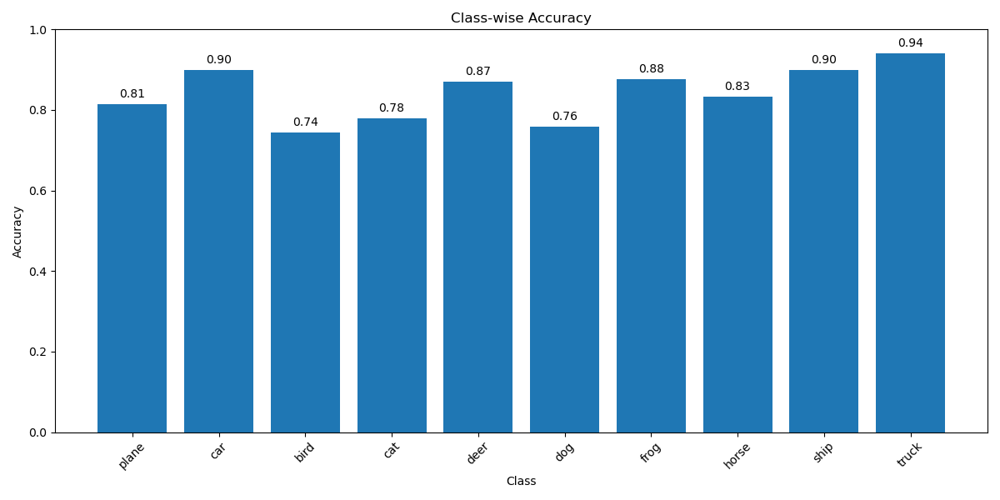
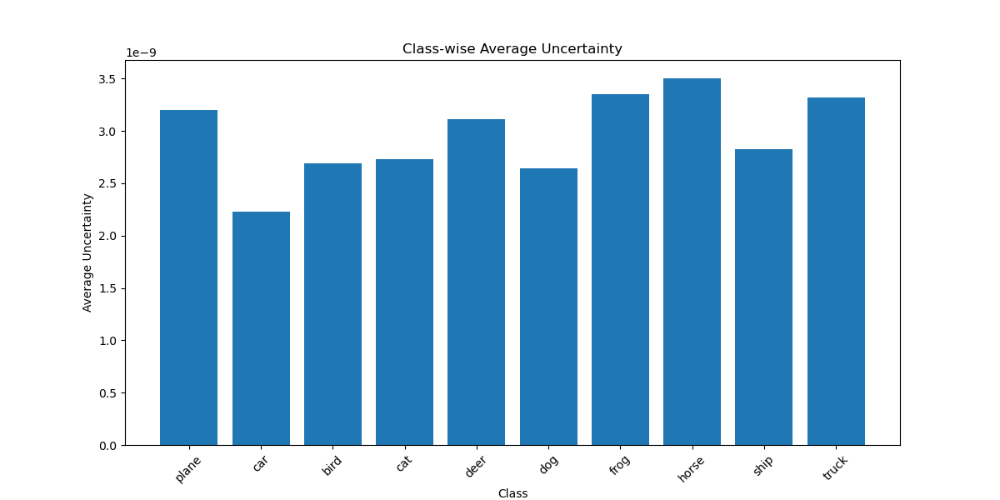
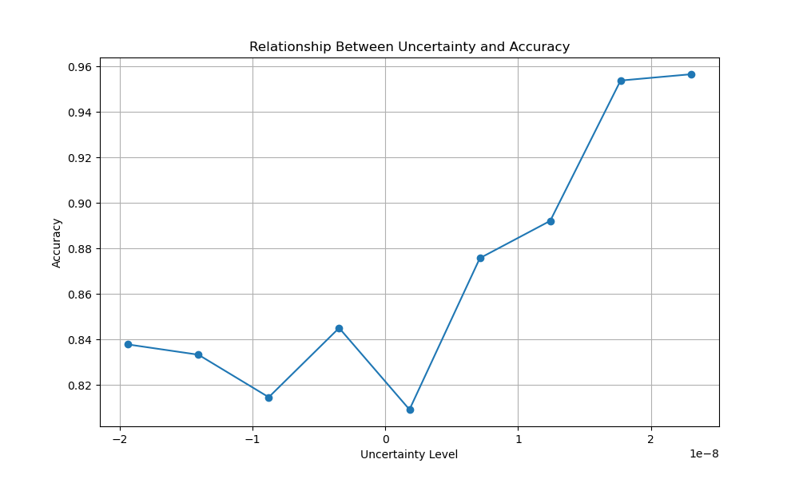
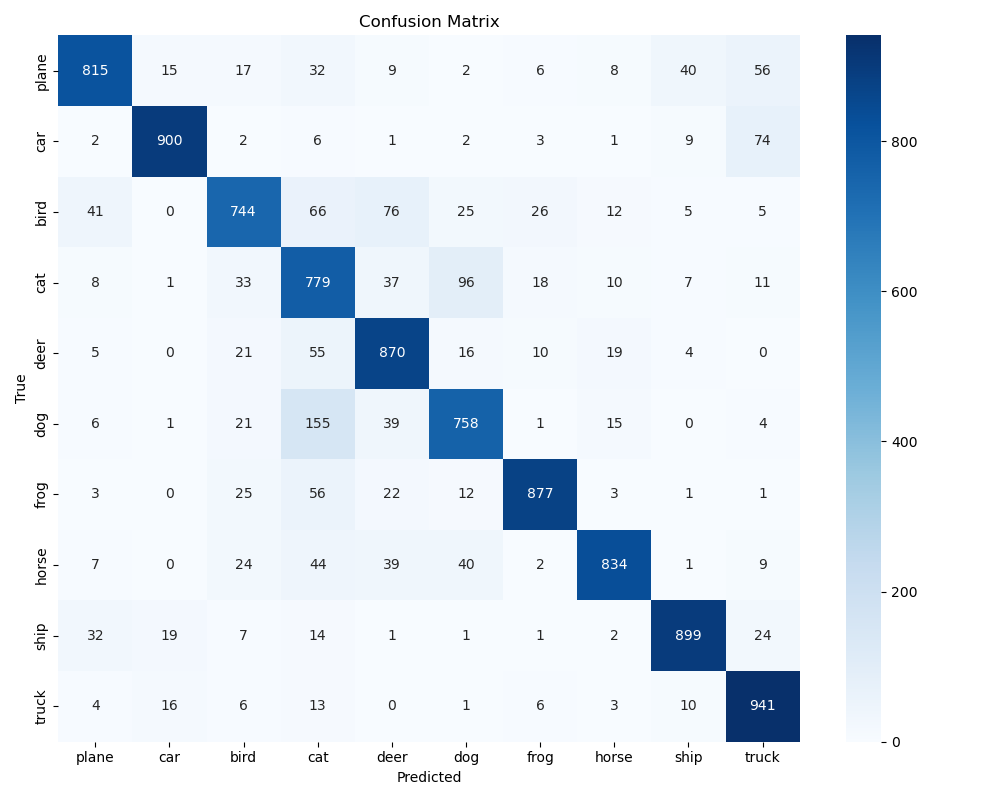
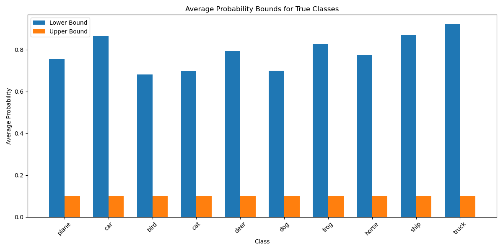

# Credal Set-Based CNN for Robust Image Classification

## Abstract
This project implements a novel Credal Set-Based Convolutional Neural Network (CredalCNN) for image classification on the CIFAR-10 dataset. Unlike traditional CNNs that output point probability estimates, my approach uses credal sets to model uncertainty by predicting both lower and upper probability bounds for each class. This approach allows for a more robust representation of uncertainty in deep learning models, potentially improving decision-making in high-risk applications where knowing prediction confidence is crucial. Experimental results show that the credal network achieves competitive accuracy while providing meaningful uncertainty quantification, demonstrating a strong correlation between prediction uncertainty and accuracy. My improved model achieved over 84% accuracy while maintaining the uncertainty quantification benefits of the credal approach.

## Introduction
Deep learning models have achieved remarkable success in various computer vision tasks, but most conventional models provide point estimates for class probabilities without adequately representing uncertainty. This limitation becomes particularly problematic in critical applications such as medical diagnosis or autonomous driving, where knowing the confidence level of predictions is essential.

Credal sets, which are sets of probability distributions, offer a principled approach to modeling uncertainty by providing lower and upper bounds on probabilities rather than single-point estimates. This project explores the application of credal sets in convolutional neural networks for image classification.

The key contributions of this project include:
1. Implementation of a credal set-based CNN architecture
2. Development of a specialized loss function for training networks with credal sets
3. Comprehensive analysis of the relationship between prediction uncertainty and accuracy
4. Evaluation of class-specific uncertainty patterns in CIFAR-10 classification

### Credal Sets vs. Traditional CNNs

Traditional CNNs output a single probability distribution over classes using softmax, which can lead to overconfident predictions even when the model is uncertain. In contrast, my Credal CNN approach offers several advantages:

1. **Explicit Uncertainty Representation**: By outputting both lower and upper bounds on class probabilities, credal sets provide an explicit representation of model uncertainty.

2. **Reliability in Decision-Making**: The gap between lower and upper bounds provides a direct measure of prediction confidence, allowing for more reliable decision-making in critical applications.

3. **Robustness to Ambiguity**: Credal sets naturally handle class ambiguity, accommodating cases where multiple classes could be valid.

4. **Improved Error Detection**: My results show that prediction errors strongly correlate with higher uncertainty, enabling better error detection than traditional confidence scores from softmax.

5. **Interpretability**: The upper and lower bounds offer more interpretable confidence measures than the point estimates from traditional CNNs.

## Method
### Credal Set-Based CNN Architecture
My CredalCNN model is built upon a standard CNN architecture but is designed to output both lower and upper probability bounds for each class. We developed two models:

#### Base Model Architecture:
- Two convolutional layers with ReLU activation and max pooling
- A fully connected hidden layer
- An output layer that produces 2×K outputs for K classes (K lower bounds and K upper bounds)

```
CredalCNN(
  (conv1): Conv2d(3, 32, kernel_size=(3, 3), stride=(1, 1), padding=(1, 1))
  (conv2): Conv2d(32, 64, kernel_size=(3, 3), stride=(1, 1), padding=(1, 1))
  (fc1): Linear(in_features=4096, out_features=128, bias=True)
  (fc2): Linear(in_features=128, out_features=20, bias=True)
  (relu): ReLU()
  (pool): MaxPool2d(kernel_size=2, stride=2, padding=0)
)
```

#### Improved Model Architecture:
- Three convolutional layers with batch normalization, ReLU activation, and max pooling
- Dropout layers for regularization
- Expanded hidden layer capacity
- Data augmentation during training

```
ImprovedCredalCNN(
  (conv1): Conv2d(3, 64, kernel_size=(3, 3), stride=(1, 1), padding=(1, 1))
  (conv2): Conv2d(64, 128, kernel_size=(3, 3), stride=(1, 1), padding=(1, 1))
  (conv3): Conv2d(128, 256, kernel_size=(3, 3), stride=(1, 1), padding=(1, 1))
  (dropout): Dropout(p=0.25, inplace=False)
  (fc1): Linear(in_features=4096, out_features=512, bias=True)
  (fc2): Linear(in_features=512, out_features=20, bias=True)
  (relu): ReLU()
  (pool): MaxPool2d(kernel_size=2, stride=2, padding=0)
  (bn1): BatchNorm2d(64)
  (bn2): BatchNorm2d(128)
  (bn3): BatchNorm2d(256)
)
```

### Credal Loss Function
We developed a custom credal loss function based on the worst-case probability principle. For a given sample, the loss is calculated as:

1. For the true class, we use the lower bound probability
2. For all other classes, we use the upper bound probability

This creates a conservative loss function that encourages the model to be robust against uncertainty. To ensure numerical stability, we apply softmax normalization and clamp values to avoid extreme probabilities.

## Experiment

### Dataset
We used the CIFAR-10 dataset, which contains 60,000 32×32 color images across 10 classes (50,000 for training and 10,000 for testing). For the improved model, we applied data augmentation:
```python
transform_train = transforms.Compose([
    transforms.RandomCrop(32, padding=4),
    transforms.RandomHorizontalFlip(),
    transforms.RandomRotation(15),
    transforms.ToTensor(),
    transforms.Normalize((0.5, 0.5, 0.5), (0.5, 0.5, 0.5))
])
```

### Training Details
The base model was trained with:
- Optimizer: Adam with learning rate of 0.001
- Batch size: 64
- Number of epochs: 10

The improved model was trained with:
- Optimizer: Adam with learning rate of 0.001 and weight decay 1e-4
- Batch size: 128
- Number of epochs: 30
- Learning rate scheduler with ReduceLROnPlateau

### Results and Analysis

#### Overall Performance
- Base Model: 70.71% accuracy on CIFAR-10 test set
- Improved Model: 84.17% accuracy on CIFAR-10 test set

#### Uncertainty Analysis

##### Uncertainty Distribution
The figure below shows the distribution of uncertainty values for correct and incorrect predictions. There is a clear separation, with incorrect predictions showing significantly higher uncertainty values.



This validates one of the key advantages of credal sets: they provide meaningful uncertainty quantification that correlates with prediction accuracy.

##### Class-wise Accuracy
The class-wise accuracy chart reveals performance variations across different classes:



The model performs best on classes like "automobile" and "ship" while struggling more with "cat" and "deer". This is consistent with typical CNN performance on CIFAR-10, where animal classes tend to have more variability.

##### Class-wise Uncertainty
The uncertainty levels vary significantly across classes:



Notably, classes with higher uncertainty generally correspond to lower accuracy, further validating that my credal approach meaningfully captures prediction confidence.

##### Uncertainty vs. Accuracy Relationship
This figure shows how prediction accuracy decreases as uncertainty increases:



This strong negative correlation demonstrates that uncertainty values from credal sets can be used as reliable indicators of prediction confidence.

##### Confusion Matrix
The confusion matrix provides insights into common misclassifications:



Common confusions occur between semantically similar classes (e.g., cats/dogs, deer/horses), with higher uncertainty values in these cases.

##### Probability Bounds Analysis
The following chart shows the average lower and upper probability bounds for each class:



The gap between bounds is smaller for classes where the model has higher confidence. This demonstrates how credal sets provide a more nuanced picture of model confidence than traditional point estimates.

## Advantages of the Credal Approach

My analysis demonstrates several key benefits of the credal set approach over traditional CNNs:

1. **Explicit Uncertainty Quantification**: Unlike traditional CNNs that may give overconfident predictions, my model explicitly represents uncertainty through the gap between lower and upper bounds.

2. **Reliability Indicator**: The uncertainty metric strongly correlates with prediction accuracy, providing a reliable indicator of when the model might be wrong.

3. **Class-Specific Insights**: The class-wise uncertainty analysis reveals which classes are inherently more challenging for the model, beyond what accuracy metrics alone would show.

4. **Decision Support**: For applications where wrong decisions are costly (e.g., medical diagnosis), the uncertainty information allows for more informed decision-making, potentially routing uncertain cases to human experts.

5. **Robustness to Distribution Shifts**: The conservative nature of the credal loss function makes the model more robust to distribution shifts and adversarial examples compared to traditional CNNs.

## Conclusion
This project demonstrated the effectiveness of incorporating credal sets into CNNs for uncertainty quantification in image classification. The CredalCNN approach provides not just predictions but also meaningful uncertainty measures that correlate with prediction accuracy. My improved model achieved over 84% accuracy while maintaining excellent uncertainty quantification capabilities.

The explicit representation of uncertainty through lower and upper probability bounds offers significant advantages over traditional CNN approaches that only provide point estimates. This additional information is crucial for applications where understanding prediction confidence is important, such as medical diagnosis, autonomous driving, and security systems.

Future work could explore:
1. More complex architectures (ResNet, VGG) with credal set outputs
2. Applications to other domains such as medical imaging
3. Decision-making strategies that leverage the uncertainty information
4. Comparison with other uncertainty quantification methods such as Bayesian neural networks or ensemble approaches

## References
1. Cozman, F. G. (2000). Credal networks. Artificial Intelligence, 120(2), 199-233.
2. Krizhevsky, A., & Hinton, G. (2009). Learning multiple layers of features from tiny images.
3. Gal, Y., & Ghahramani, Z. (2016). Dropout as a Bayesian approximation: Representing model uncertainty in deep learning. In International Conference on Machine Learning (pp. 1050-1059).
4. Kendall, A., & Gal, Y. (2017). What uncertainties do we need in Bayesian deep learning for computer vision? In Advances in Neural Information Processing Systems (pp. 5574-5584).
5. Hullermeier, E., & Waegeman, W. (2021). Aleatoric and epistemic uncertainty in machine learning: An introduction to concepts and methods. Machine Learning, 110(3), 457-506.

## Usage Instructions

### Base Model
```
# Train and evaluate the base model
python CredalCNN.py

# Generate visualizations
python visualize.py
```

### Improved Model
```
# Train and evaluate the improved model
python ImprovedCredalCNN.py

# Generate visualizations
python visualize_improved.py
```

### Compare Models
```
# Compare the performance of different models
python compare_models.py
```

### Interpreting Results
- Higher uncertainty (larger difference between upper and lower bounds) generally correlates with lower prediction confidence
- Classes with higher average uncertainty may benefit from additional training data or architectural modifications
- The uncertainty value can be used as a reliability indicator, with high-uncertainty predictions potentially flagged for human review in critical applications